# Jira: an illustrated demo

All screenshots below are native captures of the live **Codex Demo (CXD)** Jira project,
refreshed on **2026-09-08**, with Jira in **English (US)**. They replace the earlier creation-trigger
and review-label screenshots. Captures show successive moments of the demo, not one simultaneous
board state. Never infer current job activity from an older screenshot.

[Open the board](https://bartsworkspace-45974496.atlassian.net/jira/software/projects/CXD/boards/34)
· [Demo script and tickets](demo.md) · [Verified runs and PRs](verification.md)

## 1. Full backlog versus selected work

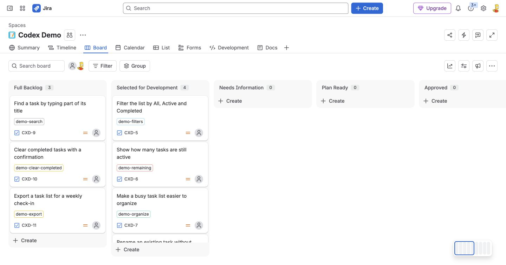

**Full Backlog** is the initial status and holds everything we might build. It does not trigger
agent execution. **Selected for Development** holds work a person has chosen to start; entry
starts clarification or planning. This is Kanban. A Sprint Backlog would imply a real sprint
with a time window and commitment, which this example does not implement.

| Board status | Owner and meaning |
| --- | --- |
| Full Backlog | Human captures and prioritizes future ideas; no model invocation |
| Selected for Development | Human selects work; Jira dispatches planning |
| Needs Information | Agent has asked questions; waits for a human reply |
| Plan Ready | Agent has posted a plan; waits for human approval |
| Approved | Allowed human approves the current plan; implementation is dispatched |
| In Progress | Agent implementation and independent CI validation are running |
| Waiting for Review | Tested PR has been published; a person can pick it up |
| In Review | Human review has started |
| Done | Human finishes the work; this example does not deploy or monitor it |

## 2. What triggers what

| User or system event | Jira rule / worker decision | Result |
| --- | --- | --- |
| Create a ticket in Full Backlog | No creation rule | Ticket stays idle |
| Comment or edit requirements in Full Backlog | Reply/edit status condition excludes it | No dispatch |
| Move into Selected for Development | Work item transitioned, destination Selected for Development | Agent posts questions or a plan |
| Human answers on active work | Work item commented, active-status filter, bot marker excluded | Context is reassessed; plan or further questions |
| Edit Summary or Description on active work | Field value changed, active-status filter | Old requirements/approval become stale; fresh plan |
| Move Plan Ready → Approved | Exact transition rule; worker verifies allowed actor and current plan | Implement → independent checks → branch and PR |
| Validation succeeds and PR is created | Trusted publisher | Finished comment with links; Waiting for Review; busy label removed |
| Human starts reviewing | Move Waiting for Review → In Review | No implementation trigger |
| Human finishes review/merge | Move to Done | No deployment or monitoring implied |

The worker also rejects unselected work when manually dispatched or reconciled. A status change
during execution stops publication. Returning a ticket to Full Backlog suspends agent work.
A changed repository base or changed requirements requires a fresh plan and approval.

## 3. Selection starts planning

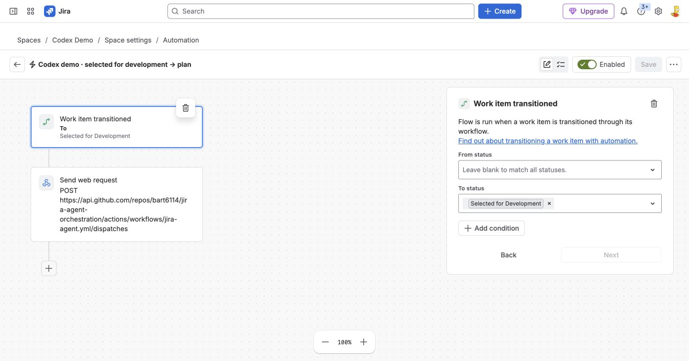

Use **Work item transitioned**, leave From status blank, and set To status to **Selected for
Development**. The old Work item created trigger is removed. The web request sends only the
issue key; the worker fetches Jira's authoritative description, comments and changelog.

## 4. Replies and requirements edits

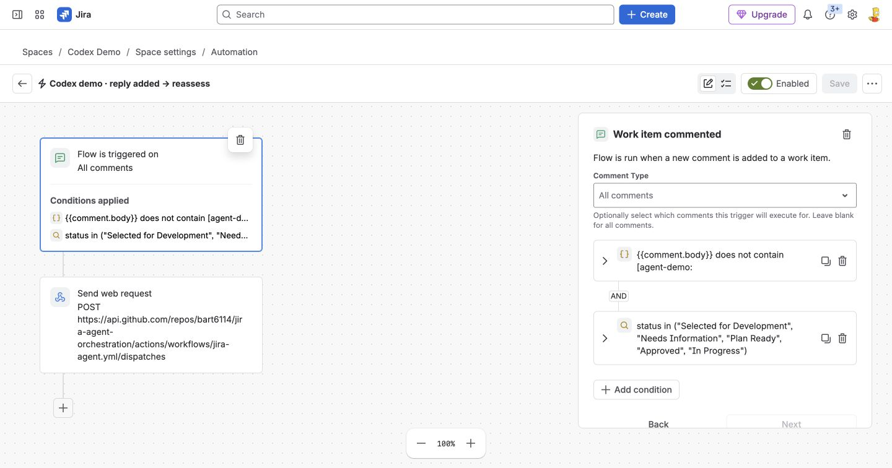

Both conditions apply: `{{comment.body}}` does not contain `[agent-demo:` AND:

```jql
status in ("Selected for Development", "Needs Information", "Plan Ready", "Approved", "In Progress")
```

The marker condition avoids bot loops. The worker verifies the signature before excluding a
comment from requirements; a human cannot forge authority merely by typing a marker.
Post-PR conversations and backlog discussions do not dispatch another coding run.

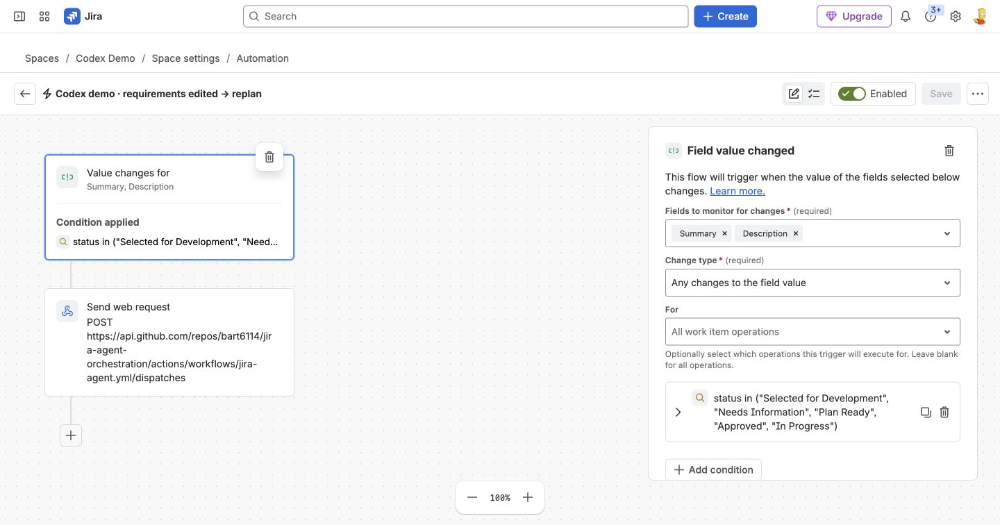

Watch **Summary** and **Description**, any value change. Keep the same JQL status condition.
Labels and routine status changes do not count as requirements edits. Comment edits/deletions
are detected at the next reconciliation; these four rules do not directly dispatch on them.

## 5. Approval starts implementation

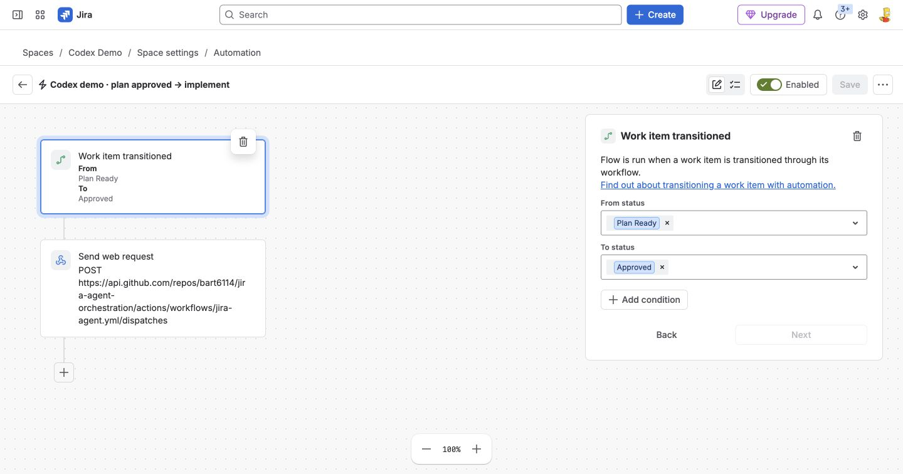

Selection and approval are separate decisions. Read the actual plan before approving it.
The worker checks that an allowlisted account performed **Plan Ready → Approved** after that
plan was published, and that the plan, requirements and repository base are still current.
Thumbs-up reactions and text saying approved do not authorize implementation.

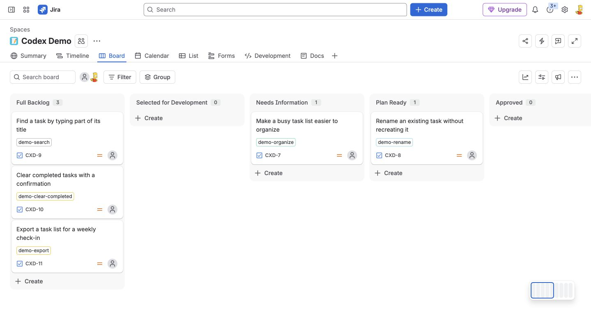

## 6. The GitHub dispatch request

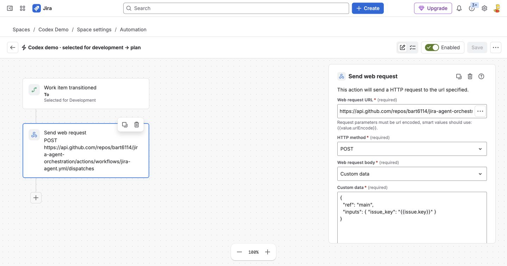

Every rule uses **Send web request**, POST, Custom data:

```json
{
  "ref": "main",
  "inputs": { "issue_key": "{{issue.key}}" }
}
```

Target `https://api.github.com/repos/OWNER/REPO/actions/workflows/jira-agent.yml/dispatches`.
Replace OWNER/REPO, default branch and Jira configuration in your setup.

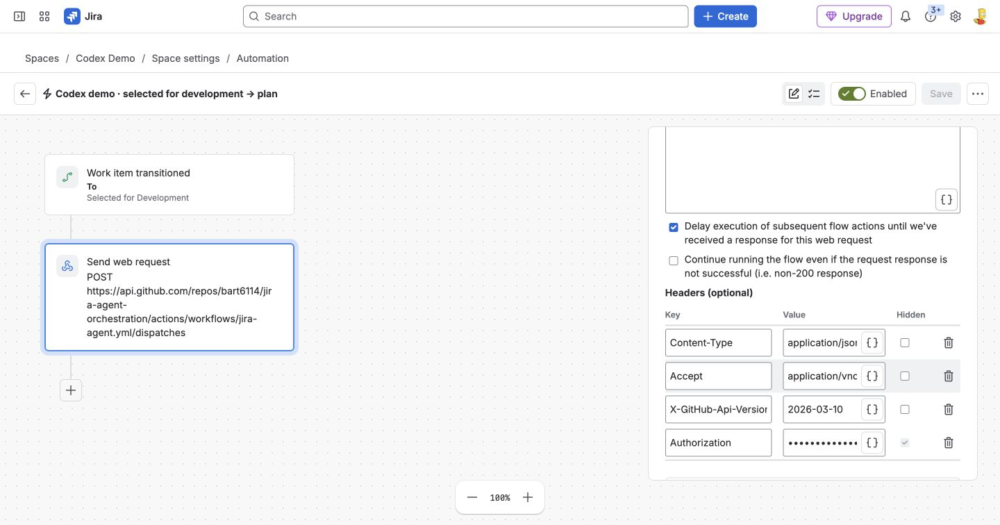

Use Content-Type `application/json`, Accept `application/vnd.github+json`, the supported GitHub
API version, and a hidden `Authorization: Bearer <repository-scoped token>` header. Keep response
waiting on. The screenshot masks the credential; never publish its value.

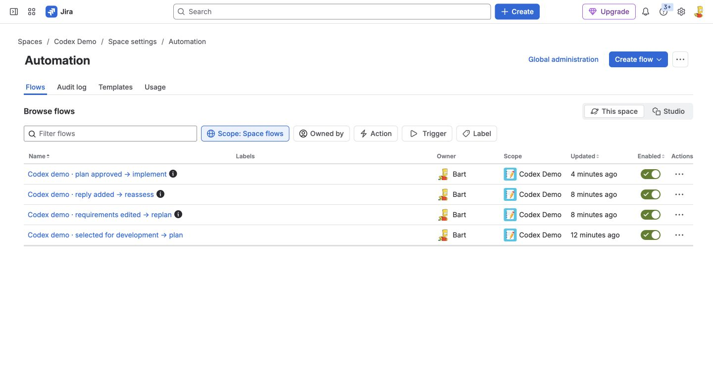

There are four enabled rules, with no creation trigger. See [setup](setup.md) for credentials,
permissions and renewal. Scheduled recovery is optional and currently disabled in the demo.

## 7. Real requirements, questions and a plan

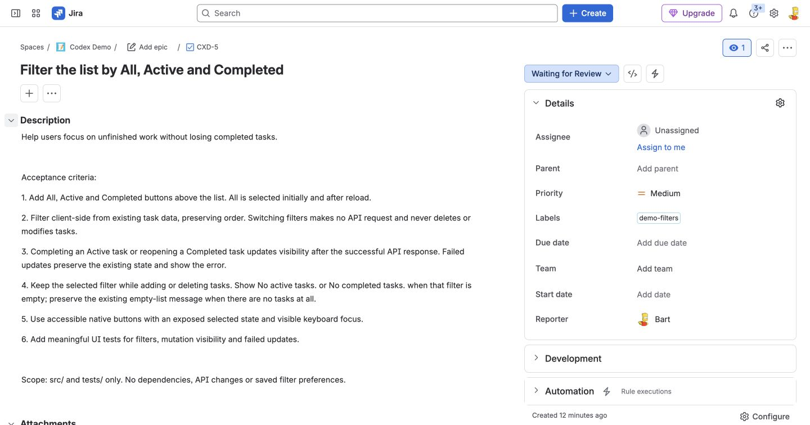

CXD-5 gives the agent bounded behavior and test expectations. The code patch may change only
`src/` and `tests/`. CXD-6 independently adds the remaining-task count.

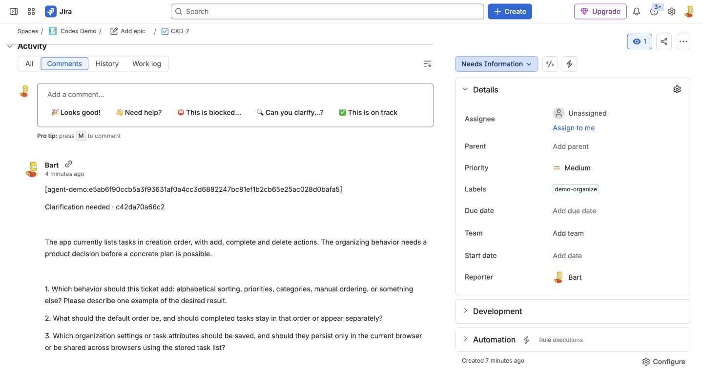

CXD-7 intentionally leaves the desired organization behavior undecided. These are real model
questions, not seeded bot text. A new human comment with the missing decisions resumes planning.

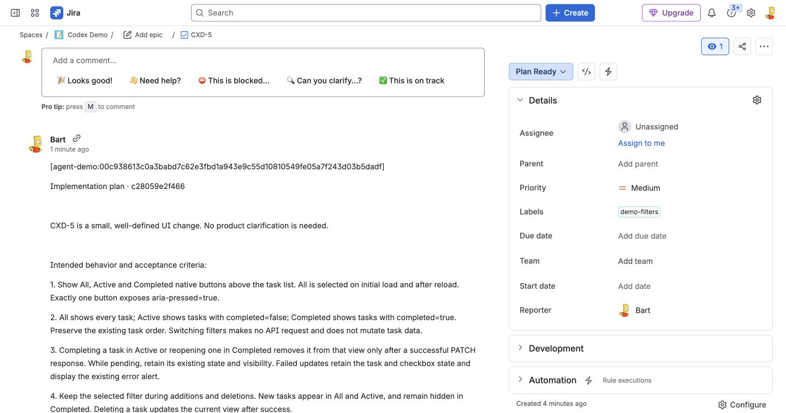

The plan is a separate comment from the completion result. The signed marker supports integrity
checking and retry deduplication. CXD-8 provides another plan that can be reviewed during a demo.

## 8. Real execution and review handoff

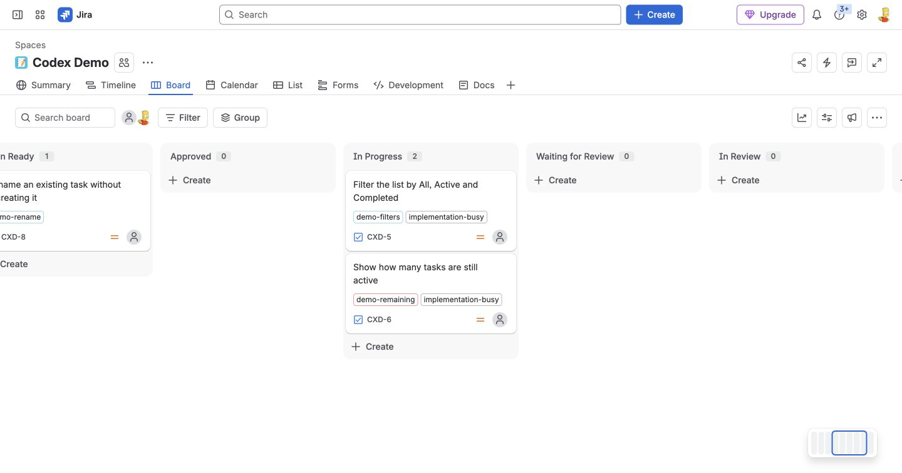

The worker adds `implementation-busy` when execution begins. The label stays through the
independent validation job. The screenshot records actual running work; current jobs can
finish before you open the board. Failures clear the busy label and report the failed run.

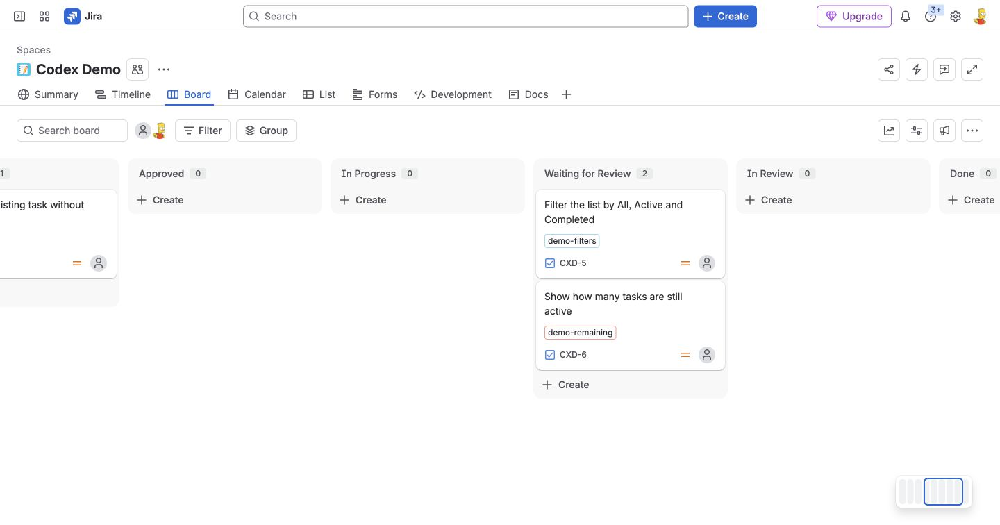

Only independent passing checks and PR publication move a ticket here. A human later moves
it to In Review. No `ready-for-review` label is used.

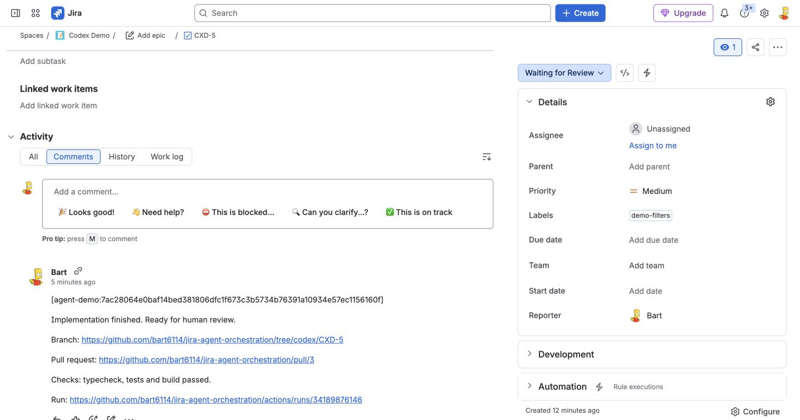

The publisher writes **Implementation finished. Ready for human review.** followed by the
branch, PR and validation-run links. Jira receives actual hyperlink formatting. Retrying
publication reuses that signed comment; no manual duplicate completion reply is needed.

## 9. The tiny application

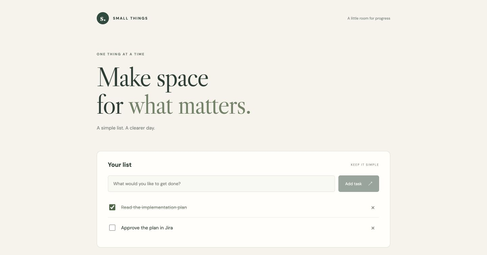

The baseline app supports add, complete and delete with a small Express/SQLite backend.
Each open feature PR changes that baseline independently; this screenshot does not claim
that unmerged PR features are already in main.

Official references: [Jira triggers](https://support.atlassian.com/cloud-automation/docs/jira-automation-triggers/),
[Jira conditions](https://support.atlassian.com/cloud-automation/docs/jira-automation-conditions/),
[GitHub dispatch](https://docs.github.com/en/rest/actions/workflows#create-a-workflow-dispatch-event).
